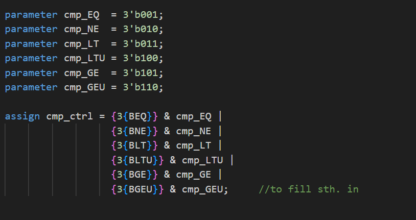
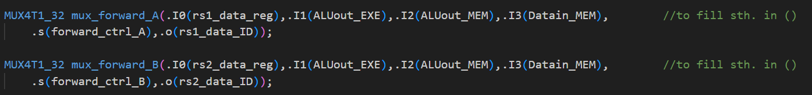

# Lab 1 Report

Files to complete:
- common/cmp_32.v
- core/HazardDetectionUnit.v
- core/CtrlUnit.v
- core/RV32core.v

## cmp_32.v
- 直接使用类似于掩码的思路进行解决即可，没什么难度

## HazardDetectionUnit.v
- 用来检测Hazard，输出信号
- 注意这里的~和!用法之间的差别，~是bitwise取反，!是整体取反

## CtrlUnit.v
- 注意有关opcode, funct7等唯一性的相关思考
- Controller单元
- 首先要完成对于Branch系列信号的赋值，首先判断Operation的类型为Branch，接下来再进一步判断funct3即可
- 注意到前面貌似并没有对U类指令的判断，且注意到U类指令的Opcode是不同的，所以这里要进行单独的判断
- 注意Lop，虽然没有Load这种指令类型，但是使用的是I-Style编码，却有自己独立的opcode
- Branch信号不能直接使用cmp_res，注意前提条件是一定要保证这些指令本身是判断branch类型的指令，否则容易出现其他情况下Branch同样为True的问题 
- cmp_ctrl直接传递给ID阶段的cmp_ctrl, 用于在ID阶段根据对应的指令类型给出对应的结果，并将对比的结果传递回ctrl unit中，所以cmp_ctrl是决定具体进行判断符号的式子。
- 这里的ctrl信号与我们在cmp_32中的实现应该是要对齐的
- 为了实现，我们这里和上面的语句学习，同样使用parameter方法

- 使用这种掩码的方式来实现，和上面保持一致
- 注意这里我们说的比较器特指的是branch操作的比较器，而不是ALU中的比较器

- 接下来是ALUSrcA和ALUSrcB，A的话在1的时候输出的应该是rs1_data，是普遍情况，而什么时候会输出PC_EXE呢，这个时候就是发生了jump的时候保存上一个PC会用到，JALR还会用到相对寻址，以及AUIPC的时候会用到PC
- B的话在1的时候输出的应该是rs2_data，同样是普通情况。Itype指令的时候是用不到的，要使用IMM，U-type和J-type同样是IMM，而U和J没有直接的编码，所以直接遍历前面所有的U和J类型的指令即可，同时load和store指令同样，不需要对rs2做运算，所以这里其实怎么填都没事，因为Jump类型的指令要用到的也不是这里的ALU，而是前面一个单独的加法器

- 接下来是rs1use信号和rs2use信号，这两个信号会传递给hazard detection unit，代表的应该是当前的指令有没有用到rs1，除了U类指令和JALR，其他指令应该都是要用到rs1的，所以这里使用反过来赋值
- rs2use信号也想通，但这里明显是要用到rs2的是少数，所以我们就使用正向的赋值即可。
- 最后就是hazard_optype，这个是用来在后面判断当前可能会产生什么类型的hazard(是否是load-use hazard)，这样则需要一个周期的stall
- 我们这里直接使用if分支来解决问题

## RV32core.v
- 用于完成接线
- 首先是Mux32 IF，这个阶段这里的选择器的目的是：选择来自于PC+4的信息还是Branch/Jump的信息，接受的信号有两个来源，一个是普通的pc+4，一个是后面计算出来要jump/branch到的target PC，使用Branch_ctrl的信号来进行决定，输出给next_PC作参考，传回PC对应的寄存器
- ID阶段涉及两个forward相关的连线，暂未完成
- EXE阶段有两个ALU相关的连线，将正确的ctrl信号连上就行
-  根据PPT中给出的图进行完整的连线，注意各个信号的命名即可
- ALU前面的两个Source同样根据PPT中完成的画图进行具体的连线，注意这里的控制信号是根据前面控制单元中给出的信息进行具体完成，这里假设muxA的0输入为pc, 1输入为reg_data_1，muxB的0输入为imm, 1的输入为reg_data_2
- mux_forward_EXE中同样使用PPT中对齐的部分完成即可，注意这里选择信号一定要和前面CtrlUnit中的设计与HazardDetectionUnit中对齐